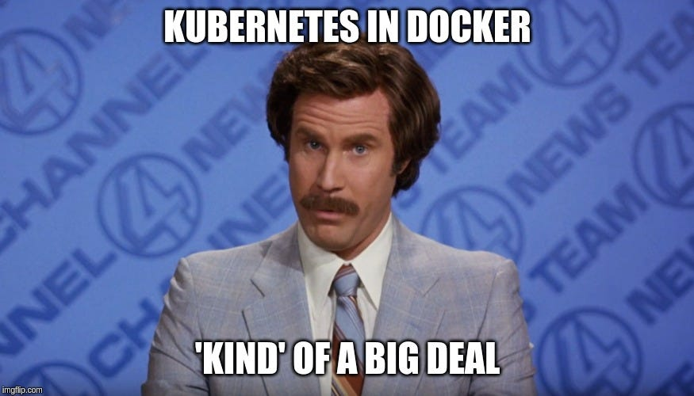

# Understanding Docker and Kubernetes 🐳☸️

Welcome to the world of Docker and Kubernetes! In this guide, we'll embark on a journey to understand these two powerful technologies and how they can revolutionize the way we build, deploy, and manage applications. 

## Docker 🐳

Docker is a popular containerization platform that allows you to package your applications and their dependencies into lightweight, isolated containers. By using Docker, you can create consistent environments for your applications and ensure they run smoothly across different systems. Docker simplifies the process of software deployment, making it easier to ship your code and its dependencies as a single unit.

To explore Docker and learn about its features, benefits, and usage, refer to the [README-Docker.md](README-Docker.md) file.

## Kubernetes ☸️

Kubernetes, often referred to as K8s, is an open-source container orchestration platform that helps you automate the deployment, scaling, and management of containerized applications. With Kubernetes, you can effectively manage clusters of containers, ensuring high availability, scalability, and resilience for your applications. It provides powerful features such as automatic scaling, service discovery, load balancing, and self-healing capabilities.

To delve into Kubernetes and understand its architecture, core concepts, and how to deploy and manage applications, refer to the [README-Kubernetes.md](README-Kubernetes.md) file.